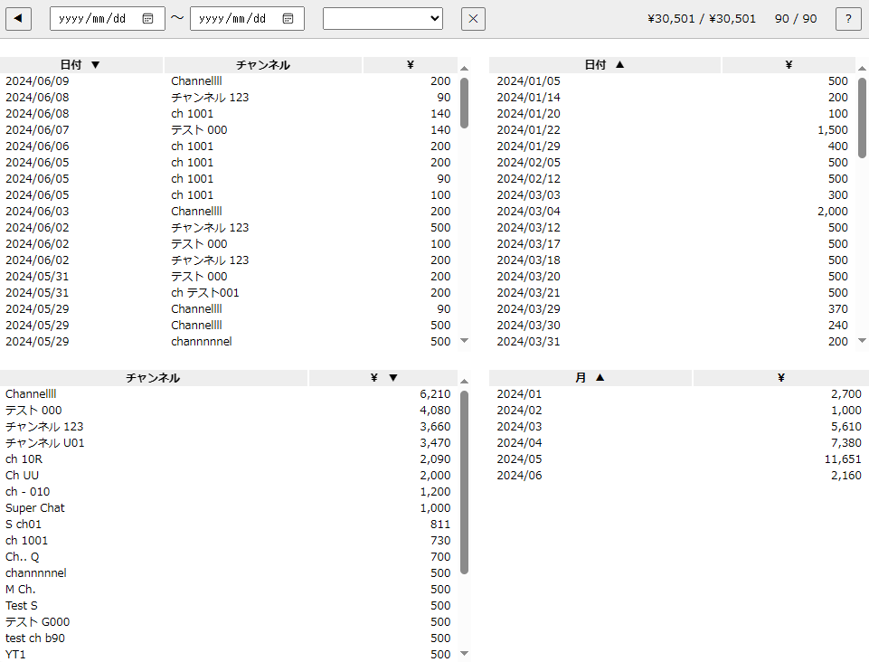

YouTube の支払履歴データを見やすく表示するツール

[この Gist ](https://gist.github.com/RYLSnmm/155b661e9ade08bdc54c5317de8c8ea6)をもう少し便利にしたもの



# データ

使うデータは JSON で入力する  

こんな形式

```json
[
    {
        "day": "2024/06/01",
        "channel": "テストチャンネル1",
        "yen": 500
    },
    {
        "day": "2024/06/04",
        "channel": "テストch.2",
        "yen": 1000
    },
]
```

この JSON データは YouTube の支払履歴画面 (https://www.youtube.com/paid_memberships) から抽出する想定

コンソールに `get.js` の内容を貼り付けて実行するとクリップボードに JSON をコピーできる

- ※抽出範囲は見えてる (DOM に存在する) ところだけなので、▼を押して追加取得を必要なだけ手動でやっておく必要あり
- ※YouTube の DOM 構造に依存するので、変わったら正しく抽出できなくなる

# 使い方

最初の画面に JSON を貼り付けて OK ボタン → 表が表示される

## 画面の説明

- ヘッダーの input/select でデータをフィルター
    - 日付範囲、チャンネル
- ✕ボタンでフィルターをクリア
- ヘッダー右の `¥1,000 / ¥12,000` 形式の表示：
    - フィルター後の項目の合計金額 / 全体の合計金額
- ヘッダー右の `10 / 100` 形式の表示：
    - フィルター後の項目数 / 全体の項目数
    - マウスを乗せると各表の行数を表示
- 左上の表：
    - フィルター後の項目一覧
- 右上の表：
    - フィルター後の項目を日付ごとに集計した一覧
- 左下の表：
    - フィルター後の項目をチャンネルごとに集計した一覧
- 右下の表：
    - フィルター後の項目を月ごとに集計した一覧
- 各表のヘッダーをクリックして並び替え
- 各表の行をクリックして、その項目をフィルターに設定：
    - `2024-01-01` をクリックしたら、フィルターの日付が `2024-01-01` になる
    - `2024-01` をクリックしたら、フィルターの日付が `2024-01-01` ～ `2024-01-31` になる
    - `チャンネル1` をクリックしたら、フィルターのチャンネルが `チャンネル1` になる
- クリックでのフィルターの設定：
    - 通常のクリック → 未設定の状態に指定のものを追加
    - Ctrl クリック → 現在のフィルターに指定のものを追加
